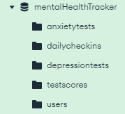

# MentalHealthTracker
The Mental Health Tracker is our final project for NMSU's CS 382/532 Mondern Web Technologies class. Like a journal, users can periodically enter their mood, goals, and other factors related to mental health. The application will display how these things have progressed over time.

## Team Members
1. Devon Sookhoo
2. Brittany Benedict
3. Luis Espinoza
4. Edgar Ochoa
5. Desiree Gutierrez

## Setup

### Install Dependencies
Remember to run `$ npm install` to install all dependencies.

### MongoDB
The database & collection names must match:

### Run Server
While in the project root directory, run `$ node index.js`

### Sample Data
With the server running, go to the following url to populate the mentalHealthTracker
Database with sample data:
[http://localhost:3000/add_test_data](http://localhost:3000/add_test_data)